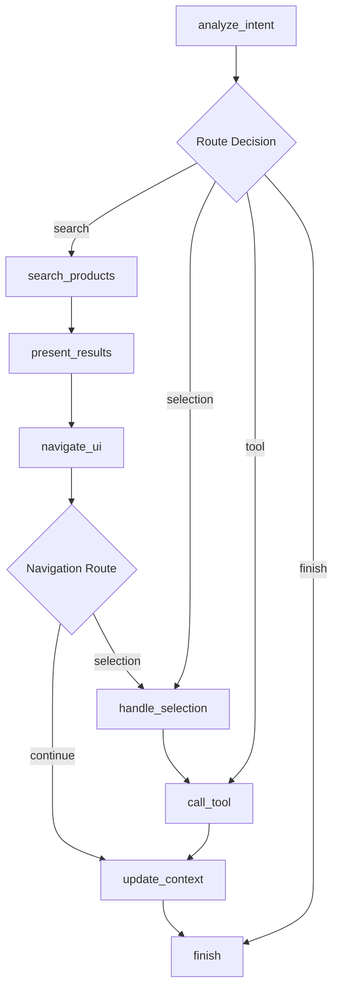

# E-commerce Platform

A modern, scalable e-commerce platform built with microservices architecture, featuring a React frontend and Go-based backend services.

## 🏗️ Architecture Overview

This project implements a **microservices architecture** with the following components:

- **Frontend**: React-based web application with TypeScript and Tailwind CSS
- **API Gateway**: Central routing and proxy service
- **Microservices**: Individual services for different business domains
- **Databases**: Multiple database systems optimized for specific services
- **Containerization**: Docker containers for easy deployment and scalability

## 🚀 Features

### Core E-commerce Features
- 🛍️ **Product Catalog**: Browse products by categories with advanced filtering
- 🛒 **Shopping Cart**: Add, remove, and manage cart items
- ❤️ **Wishlist**: Save favorite products for later
- 👤 **User Management**: Registration, authentication, and profile management
- 📋 **Order Management**: Complete order processing workflow
- ⭐ **Review System**: Product reviews and ratings
- 📦 **Inventory Management**: Real-time stock tracking
- 🤖 **Chatbot Integration**: AI-powered customer support

### Technical Features
- 📱 **Responsive Design**: Mobile-first approach with adaptive UI
- 🔍 **Advanced Search**: Smart search with suggestions and filtering
- 🔐 **JWT Authentication**: Secure token-based authentication
- 📊 **Real-time Updates**: Live inventory and cart updates
- 🌐 **RESTful APIs**: Well-structured API endpoints
- 📈 **Health Monitoring**: Service health checks and monitoring
- 🐳 **Docker Support**: Containerized services for easy deployment

## 🛠️ Technology Stack

### Frontend (Client)
- **Framework**: React with TypeScript
- **Styling**: Tailwind CSS
- **Build Tool**: Vite/Remix
- **State Management**: React Hooks & Context API
- **HTTP Client**: Fetch API with custom utilities
- **Icons**: Lucide React
- **Responsive**: Mobile-first design approach

### Backend (Server)
- **Language**: Go (Golang)
- **Framework**: HTTP standard library with custom routing
- **Architecture**: Microservices
- **Authentication**: JWT tokens
- **Logging**: Structured logging with Zap/Logrus
- **Configuration**: Viper for configuration management
- **Health Checks**: Built-in health monitoring

### Databases
- **MySQL 8.0**: Product catalog and related data
- **PostgreSQL 15**: Orders, reviews, inventory, and user data
- **Connection Pooling**: Optimized database connections

### DevOps & Infrastructure
- **Containerization**: Docker & Docker Compose
- **Reverse Proxy**: API Gateway with request routing
- **Service Discovery**: Container-based service communication
- **Health Monitoring**: Health check endpoints for all services
- **CORS**: Cross-origin resource sharing configuration

## 📁 Project Structure

```
├── client/                          # Frontend React application
│   ├── app/
│   │   ├── components/             # Reusable React components
│   │   │   ├── layout/            # Layout components (Header, Sidebar, etc.)
│   │   │   └── ui/                # UI components
│   │   ├── hooks/                 # Custom React hooks
│   │   ├── contexts/              # React context providers
│   │   ├── routes/                # Application routes
│   │   └── api/                   # API utilities and types
│   └── public/                    # Static assets
│
├── server/                         # Backend microservices
│   ├── api-gateway/               # Central API gateway service
│   │   ├── config/               # Configuration management
│   │   ├── proxy/                # Request routing and proxying
│   │   └── middleware/           # CORS, logging, authentication
│   │
│   ├── user/                     # User management service
│   ├── product/                  # Product catalog service
│   ├── cart/                     # Shopping cart service
│   ├── wishlist/                 # Wishlist management service
│   ├── order/                    # Order processing service
│   ├── review/                   # Product review service
│   ├── inventory/                # Inventory management service
│   └── chatbot/                  # AI chatbot service
│
└── docker-compose.yml            # Multi-service container orchestration
```

## 🔧 Services Overview

### API Gateway (Port: 9000)
**Technology**: Go with Gorilla Mux
- **Purpose**: Central entry point for all client requests
- **Key Features**:
  - Reverse proxy with intelligent routing
  - JWT authentication middleware
  - CORS handling for cross-origin requests
  - Request/response logging with structured logs
  - Service health monitoring
  - Rate limiting support (planned)
- **Routing Logic**: Routes requests based on URL prefixes to appropriate microservices
- **Security**: Validates JWT tokens and injects user context into downstream services

### Detailed Microservices Architecture

#### 1. User Service (Port: 5009)
**Technology**: C# ASP.NET Core with Entity Framework
**Database**: PostgreSQL
- **Core Responsibilities**:
  - User registration and authentication
  - Password management with HMAC-SHA512 hashing
  - JWT token generation and validation
  - User profile management
  - Role-based access control
- **Key Features**:
  - Secure password hashing with salt
  - Email uniqueness validation
  - Password change functionality
  - User existence checks
  - Token-based authentication with configurable expiration
- **API Endpoints**:
  - `POST /auth/login` - User authentication
  - `POST /auth/register` - New user registration
  - `POST /auth/change-password` - Password updates
  - `GET /user/profile` - User profile retrieval
  - `PUT /user/profile` - Profile updates

#### 2. Product Service (Port: 8082)
**Technology**: Java Spring Boot with JPA/Hibernate
**Database**: MySQL 8.0
- **Core Responsibilities**:
  - Product catalog management
  - Category and brand management
  - Product search and filtering
  - Inventory status integration
  - Product analytics and recommendations
- **Advanced Features**:
  - Redis caching for high-performance queries
  - Batch inventory status checking via gRPC
  - Full-text search capabilities
  - Price range filtering
  - Rating-based product recommendations
  - Sales statistics tracking
- **API Endpoints**:
  - `GET /products` - Paginated product listing with filters
  - `GET /products/{id}` - Product details with real-time inventory
  - `GET /products/search` - Advanced product search
  - `GET /products/category/{categoryId}` - Category-based filtering
  - `GET /products/top-selling` - Best selling products
  - `GET /products/top-rated` - Highest rated products
  - `GET /categories` - Product categories hierarchy
  - `GET /brands` - Available brands

#### 3. Cart Service (Port: 8002)
**Technology**: Node.js/TypeScript with Express
**Database**: PostgreSQL
- **Core Responsibilities**:
  - Shopping cart management
  - Cart item operations (add, update, remove)
  - Real-time pricing calculations
  - Guest cart to user cart migration
  - Checkout preparation
- **Advanced Features**:
  - Inventory validation before adding items
  - Automatic price updates
  - Cart persistence across sessions
  - Guest cart support with session management
  - Cart analytics and statistics
- **API Endpoints**:
  - `GET /cart` - Retrieve user's cart with pricing
  - `POST /cart/items` - Add items to cart
  - `PUT /cart/items/{id}` - Update item quantities
  - `DELETE /cart/items/{id}` - Remove specific items
  - `DELETE /cart` - Clear entire cart
  - `POST /cart/checkout/prepare` - Prepare cart for checkout

#### 4. Wishlist Service (Port: 8084)
**Technology**: Node.js/TypeScript with Express
**Database**: PostgreSQL
- **Core Responsibilities**:
  - Wishlist management
  - Product favorites tracking
  - Wishlist analytics
  - Social wishlist features (planned)
- **Key Features**:
  - Add/remove products from wishlist
  - Wishlist statistics and insights
  - Most wishlisted products tracking
  - Wishlist sharing capabilities (planned)
- **API Endpoints**:
  - `GET /wishlist` - User's wishlist items
  - `POST /wishlist/items` - Add product to wishlist
  - `DELETE /wishlist/items/{productId}` - Remove from wishlist
  - `DELETE /wishlist` - Clear entire wishlist
  - `GET /wishlist/stats` - Wishlist analytics

#### 5. Order Service (Port: 8004)
**Technology**: Java Spring Boot / Python FastAPI
**Database**: PostgreSQL
- **Core Responsibilities**:
  - Order creation and processing
  - Order history management
  - Order status tracking
  - Payment integration
  - Order fulfillment workflow
- **Key Features**:
  - Multi-step order processing pipeline
  - Order status notifications
  - Order cancellation with inventory restoration
  - Order analytics and reporting
- **API Endpoints**:
  - `POST /orders` - Create new order
  - `GET /orders` - User order history
  - `GET /orders/{id}` - Order details
  - `PUT /orders/{id}/cancel` - Cancel order
  - `GET /orders/{id}/status` - Track order status

#### 6. Review Service (Port: 8003)
**Technology**: Python FastAPI with SQLAlchemy
**Database**: PostgreSQL
- **Core Responsibilities**:
  - Product review management
  - Rating calculations
  - Review moderation
  - Review analytics
- **Key Features**:
  - Star rating system (1-5 stars)
  - Review text and image support
  - Automated rating aggregation
  - Review helpfulness voting
  - Spam detection (planned)
- **API Endpoints**:
  - `GET /reviews/product/{productId}` - Product reviews
  - `POST /reviews` - Create new review
  - `PUT /reviews/{id}` - Update review
  - `DELETE /reviews/{id}` - Delete review
  - `POST /reviews/{id}/helpful` - Mark review as helpful

#### 7. Inventory Service (Port: 5440)
**Technology**: Go with GORM
**Database**: PostgreSQL
- **Core Responsibilities**:
  - Real-time inventory tracking
  - Stock reservation system
  - Inventory history logging
  - Low stock alerts
  - Batch inventory operations
- **Advanced Features**:
  - Temporary stock reservations for cart items
  - Automatic reservation expiration
  - Inventory movement tracking
  - Multi-location inventory support (planned)
- **API Endpoints**:
  - `GET /inventory/{productId}` - Product stock levels
  - `POST /inventory/batch` - Batch stock checking
  - `POST /reservations` - Reserve inventory
  - `POST /reservations/{id}/confirm` - Confirm reservation
  - `POST /reservations/{id}/cancel` - Cancel reservation
  - `GET /inventory/{productId}/history` - Stock movement history

#### 8. Chatbot Service (Port: 8000) - Advanced AI Workflow
**Technology**: Python with LangChain, LangGraph, and Grok AI
**Architecture**: 8-Node State Machine Workflow
**Database**: Memory-based conversation state management

##### 🧠 **LangGraph Workflow Architecture**

The chatbot implements a sophisticated 8-node workflow using LangGraph for intelligent conversation management:



##### 📋 **Detailed Node Descriptions**

**1. 🎯 analyze_intent**
- **Purpose**: AI-powered intent recognition and parameter extraction
- **AI Model**: Grok AI for natural language understanding
- **Capabilities**:
  - Recognizes 20+ different intents across product, cart, order, wishlist domains
  - Extracts filters (price range, category, brand, rating)
  - Handles context-aware conversations
  - Distinguishes between product selection vs direct product ID references
- **Output**: Intent classification, extracted parameters, conversation context

**2. 🔍 search_products**
- **Purpose**: Product search and filtering based on extracted intent
- **Supported Search Types**:
  - `search_product`: Keyword-based product search
  - `get_top_rated`: Highest rated products (>4.0 stars)
  - `get_top_selling`: Best selling products
  - `get_new_arrivals`: Recently added products
- **Advanced Filtering**:
  - Category-based filtering (27 supported categories)
  - Price range filtering (min/max price)
  - Brand filtering
  - Rating-based filtering
  - Inventory status filtering

**3. 📊 present_results**
- **Purpose**: Format and present search results in user-friendly format
- **Features**:
  - Structured product listings with images, prices, ratings
  - Smart pagination and result limiting
  - Interactive product numbering for easy selection
  - Rich formatting with emojis and visual elements
  - Context preservation for follow-up interactions

**4. 🎯 handle_selection**
- **Purpose**: Process user selections from displayed lists
- **Selection Types**:
  - Numbered selection: "sản phẩm 1", "thứ hai", "cái đầu tiên"
  - Action-based: "thêm sản phẩm 2 vào giỏ", "chi tiết sản phẩm 3"
  - Context-aware selection from cart, wishlist, or search results
- **Supported Actions**:
  - `view_detail`: Get detailed product information
  - `add_to_cart`: Add selected product to shopping cart
  - `add_to_wishlist`: Add to user's wishlist
  - `remove_from_cart`: Remove from cart
  - `remove_from_wishlist`: Remove from wishlist

**5. 🛠️ call_tool**
- **Purpose**: Execute API calls to backend services
- **Service Integrations**:
  - **ProductTools**: Product search, categories, brands
  - **CartTools**: Cart management, checkout preparation
  - **OrderTools**: Order history, creation, tracking
  - **WishlistTools**: Wishlist operations
- **Authentication**: JWT token-based service calls
- **Error Handling**: Graceful fallback for service failures

**6. 🧭 navigate_ui**
- **Purpose**: Generate frontend navigation suggestions
- **URL Generation**: Dynamic URL creation with query parameters
- **Supported Routes**:
  - `/search?q=keyword&categoryName=...&minPrice=...`
  - `/product/{productId}` for product details
  - `/cart`, `/orders`, `/wishlist` for user sections
- **Context Preservation**: Maintains search filters across navigation

**7. 🔄 update_context**
- **Purpose**: Maintain conversation state and context
- **State Management**:
  - Cart state synchronization
  - Search results caching
  - User preferences tracking
  - Conversation history maintenance
- **Memory Optimization**: Cleanup unused state data

**8. ✅ finish**
- **Purpose**: Generate final AI response and complete interaction
- **Response Types**:
  - Search result presentations
  - Action confirmations
  - Error messages with helpful suggestions
  - Follow-up action recommendations
- **Context-Aware Responses**: Tailored responses based on conversation history

##### 🔄 **Intelligent Routing Logic**

**Intent-Based Routing**:
```python
def route_after_intent(state: ChatState) -> str:
    intent = state.get("last_intent")
    
    # Search intents → search_products
    if intent in ["search_product", "get_top_rated", "get_top_selling"]:
        return "search"
    
    # Direct tool calls → call_tool
    elif intent in ["view_cart", "view_orders", "get_brands"]:
        return "tool"
    
    # Selection handling → handle_selection
    elif has_selection_context_and_keywords():
        return "selection"
    
    else:
        return "finish"
```

**Context-Aware Selection Detection**:
```python
# Detects user selections from current context
selection_keywords = ["sản phẩm", "đầu tiên", "thứ", "chi tiết", "thêm", "mua"]
has_selection = any(keyword in user_message for keyword in selection_keywords)
has_context = bool(search_results or cart_items or wishlist_items)

if has_selection and has_context:
    route_to_selection()
```

##### 🎯 **Supported Intent Categories**

**Product Management (7 intents)**:
- `search_product`: General product search
- `get_product_detail`: Specific product information
- `get_top_rated`: High-rated products (>4.0 stars)
- `get_top_selling`: Best selling products
- `get_new_arrivals`: New products
- `get_brands`: Brand directory
- `get_categories`: Category listing

**Cart Management (5 intents)**:
- `view_cart`: Display current cart
- `add_to_cart`: Add products to cart
- `remove_from_cart`: Remove cart items
- `clear_cart`: Empty entire cart
- `prepare_checkout`: Prepare for order

**Order Management (4 intents)**:
- `view_orders`: Order history
- `get_order_detail`: Specific order info
- `create_order`: Place new order
- `cancel_order`: Cancel existing order

**Wishlist Management (3 intents)**:
- `view_wishlist`: Display favorites
- `add_to_wishlist`: Add to favorites
- `remove_from_wishlist`: Remove from favorites

##### 🤖 **AI Capabilities**

**Natural Language Understanding**:
- **Vietnamese Language Support**: Native Vietnamese conversation
- **Context Awareness**: Maintains conversation history and user preferences
- **Multi-turn Conversations**: Handles complex, multi-step interactions
- **Ambiguity Resolution**: Clarifies unclear requests with follow-up questions

**Smart Product Recommendations**:
- **Category-based Suggestions**: Recommends products in related categories
- **Price-aware Filtering**: Suggests alternatives within user's budget
- **Rating-based Recommendations**: Prioritizes highly-rated products
- **Personalized Suggestions**: Based on user's cart and wishlist history

##### 📊 **State Management**

**Conversation State Schema**:
```python
class ChatState(TypedDict):
    messages: List[BaseMessage]           # Conversation history
    last_intent: str                      # Current user intent
    filters: Dict[str, Any]              # Search/filter parameters
    search_results: Dict[str, Any]       # Product search results
    cart_items: List[Dict]               # Current cart context
    wishlist_items: List[Dict]           # Wishlist context
    selected_product: Dict               # Currently selected product
    user_token: str                      # Authentication token
    suggested_url: str                   # Frontend navigation
    tool_result: Dict[str, Any]          # API call results
    final_response: str                  # AI-generated response
```

##### 🔧 **Advanced Features**

**Error Handling & Fallbacks**:
- Service unavailability graceful handling
- Authentication error management
- Invalid request parameter handling
- Timeout and retry mechanisms

**Performance Optimizations**:
- **Async API Calls**: Non-blocking service communication
- **State Caching**: Efficient conversation state management
- **Response Streaming**: Real-time response generation
- **Memory Management**: Automatic state cleanup

**Security Features**:
- **JWT Token Validation**: Secure service authentication
- **Input Sanitization**: Prevents injection attacks
- **Rate Limiting**: Conversation throttling (planned)
- **Privacy Protection**: No sensitive data logging

##### 📡 **Chatbot API Endpoints**

**Send Message to AI Assistant**:
```http
POST /api/v1/chat
Authorization: Bearer {jwt_token}
Content-Type: application/json

{
  "message": "Tôi muốn tìm laptop gaming dưới 20 triệu",
  "conversationId": "conv_123",
  "context": {
    "currentPage": "/products",
    "userPreferences": {}
  }
}
```

**Response Examples**:

*Product Search Response*:
```json
{
  "status": "success",
  "data": {
    "response": "🔍 **Tìm thấy 15 laptop gaming phù hợp ngân sách dưới 20 triệu:**\n\n1. **ASUS ROG Strix G15** - ⭐ 4.5/5\n   💰 18,990,000đ (Giảm 13%)\n   🔥 Đã bán 1,234 | 💚 Còn hàng\n\n2. **MSI Katana GF66** - ⭐ 4.3/5\n   💰 17,500,000đ\n   🔥 Đã bán 892 | 💚 Còn hàng\n\n**🛒 Các thao tác:**\n- \"Chi tiết sản phẩm 1\" để xem thêm\n- \"Thêm sản phẩm 1 vào giỏ\" để mua\n- \"So sánh sản phẩm 1 và 2\"",
    "conversationId": "conv_123",
    "suggestedActions": [
      {
        "type": "view_products",
        "label": "Xem tất cả laptop gaming",
        "url": "/search?categoryName=Laptop&maxPrice=20000000&keyword=gaming"
      },
      {
        "type": "filter",
        "label": "Lọc theo thương hiệu",
        "url": "/search?brandName=ASUS,MSI&maxPrice=20000000"
      }
    ],
    "metadata": {
      "intent": "search_product",
      "confidence": 0.95,
      "productsFound": 15,
      "avgPrice": 18245000,
      "priceRange": "15,500,000 - 19,990,000",
      "topBrands": ["ASUS", "MSI", "Acer"]
    }
  }
}
```

*Cart Management Response*:
```json
{
  "status": "success",
  "data": {
    "response": "🛒 **Giỏ hàng của bạn có 3 sản phẩm:**\n\n1. **ASUS ROG Strix G15**\n   💰 2 x 18,990,000đ = 37,980,000đ\n\n2. **Logitech G Pro Wireless**\n   💰 1 x 2,590,000đ = 2,590,000đ\n\n💰 **Tổng cộng: 40,570,000đ**\n\n🔍 **Các thao tác:**\n- \"Xóa sản phẩm 1\" để xóa khỏi giỏ\n- \"Thanh toán\" để đặt hàng",
    "conversationId": "conv_123",
    "suggestedActions": [
      {
        "type": "checkout",
        "label": "Tiến hành thanh toán",
        "url": "/checkout"
      },
      {
        "type": "continue_shopping",
        "label": "Tiếp tục mua sắm",
        "url": "/search"
      }
    ],
    "metadata": {
      "intent": "view_cart",
      "itemCount": 3,
      "totalValue": 40570000,
      "estimatedDelivery": "2-3 ngày"
    }
  }
}
```

*Order Tracking Response*:
```json
{
  "status": "success",
  "data": {
    "response": "📦 **Đơn hàng #ORD-2025-001234:**\n\n📋 **Trạng thái:** Đang giao hàng\n🚚 **Vận chuyển:** GHN Express\n📍 **Mã vận đơn:** GHNE123456789\n📅 **Dự kiến giao:** 15/01/2025\n\n**📱 Theo dõi:**\n✅ Đã xác nhận (12/01 - 10:30)\n✅ Đã đóng gói (12/01 - 14:20)\n✅ Đã giao cho ĐVVC (13/01 - 09:15)\n🚚 Đang vận chuyển (14/01 - 08:45)\n⏳ Đang giao hàng",
    "conversationId": "conv_123",
    "suggestedActions": [
      {
        "type": "track_order",
        "label": "Theo dõi chi tiết",
        "url": "/orders/ORD-2025-001234"
      }
    ],
    "metadata": {
      "intent": "get_order_detail",
      "orderId": "ORD-2025-001234",
      "status": "SHIPPING",
      "trackingNumber": "GHNE123456789"
    }
  }
}
```

##### 🎯 **Example Conversation Flows**

**Multi-turn Product Discovery**:
```
User: "Tôi cần mua laptop cho công việc"
Bot: "💼 Laptop cho công việc! Bạn có thể cho biết:
     - Ngân sách dự kiến?
     - Công việc chủ yếu (văn phòng, thiết kế, lập trình)?
     - Thương hiệu ưa thích?"

User: "Dưới 25 triệu, làm lập trình"
Bot: "🔍 Tìm thấy 12 laptop lập trình dưới 25 triệu:
     1. **Dell XPS 13** - Core i7, 16GB RAM - ⭐ 4.6/5
     2. **MacBook Air M2** - 8-core, 16GB - ⭐ 4.8/5
     ..."

User: "Chi tiết sản phẩm 1"
Bot: "💻 **Dell XPS 13 Developer Edition:**
     🔧 Intel Core i7-1360P, 16GB LPDDR5
     💾 512GB SSD NVMe, Intel Iris Xe
     📺 13.4\" 4K InfinityEdge Display
     🔋 57Wh battery, 19h usage
     💰 22,990,000đ (Giảm 8% từ 24,990,000đ)"

User: "Thêm vào giỏ hàng"
Bot: "✅ Đã thêm Dell XPS 13 vào giỏ hàng!
     🛒 Giỏ hàng: 1 sản phẩm - 22,990,000đ
     💡 Gợi ý: Thêm chuột wireless và túi laptop?"
```

**Smart Error Handling**:
```
User: "Xóa sản phẩm 5"
Bot: "❌ Không tìm thấy sản phẩm thứ 5 trong danh sách hiện tại.
     🔍 Hiện tại có 3 sản phẩm:
     1. Dell XPS 13
     2. MacBook Air M2  
     3. ThinkPad X1 Carbon
     Bạn muốn xóa sản phẩm nào?"
```

##### 🔬 **Advanced Workflow Examples**

**Context-Aware Product Recommendations**:
```python
# User has laptop in cart, chatbot suggests accessories
if user_cart_contains("laptop"):
    suggest_accessories = [
        "laptop_bag", "wireless_mouse", "external_monitor", 
        "laptop_stand", "wireless_keyboard"
    ]
    
# User browsing gaming category, suggest gaming peripherals
if current_category == "gaming":
    cross_sell_items = [
        "gaming_mouse", "mechanical_keyboard", 
        "gaming_headset", "monitor"
    ]
```

**Dynamic Price Intelligence**:
```python
# Real-time price comparison and alerts
async def check_price_trends(product_id):
    current_price = await get_current_price(product_id)
    price_history = await get_price_history(product_id, days=30)
    
    if current_price < average(price_history):
        return "📉 Giá hiện tại thấp hơn 15% so với 30 ngày qua. Thời điểm tốt để mua!"
    elif price_drop_trend(price_history):
        return "⏰ Giá đang có xu hướng giảm. Có thể chờ thêm vài ngày."
```

**Intelligent Inventory Management**:
```python
# Stock-aware recommendations
async def suggest_alternatives(product_id):
    inventory = await check_inventory(product_id)
    
    if inventory.status == "LOW_STOCK":
        return f"⚠️ Chỉ còn {inventory.quantity} sản phẩm. Đặt hàng sớm để không bỏ lỡ!"
    elif inventory.status == "OUT_OF_STOCK":
        alternatives = await find_similar_products(product_id)
        return f"😕 Sản phẩm hết hàng. Gợi ý thay thế: {alternatives}"
```

##### 🎨 **Response Personalization**

**User Behavior Analysis**:
- **Purchase History**: Recommend based on previous orders
- **Browsing Patterns**: Suggest categories user frequently visits
- **Price Sensitivity**: Adjust recommendations to user's budget range
- **Brand Preference**: Prioritize preferred brands in suggestions

**Contextual Awareness**:
- **Time-based**: Different suggestions for morning vs evening
- **Location-based**: Shipping and availability based on user location
- **Device-based**: Mobile vs desktop optimized responses
- **Session Context**: Remember conversation flow and preferences

This sophisticated chatbot service represents a state-of-the-art AI customer service solution, combining advanced NLP, intelligent workflow management, and seamless e-commerce integration to provide users with an exceptional shopping experience.

#### 9. Notification Service (Port: 8001)
**Technology**: Node.js/TypeScript with Express
**Database**: PostgreSQL
- **Core Responsibilities**:
  - Push notification management
  - Device registration
  - Notification preferences
  - Email notifications (planned)
- **Features**:
  - Multi-device notification support
  - User notification preferences
  - Test notification endpoints
  - Notification history tracking
- **API Endpoints**:
  - `POST /devices` - Register device for notifications
  - `GET /preferences` - User notification settings
  - `PUT /preferences` - Update notification preferences
  - `POST /test` - Send test notification

### Service Communication Patterns

#### Inter-Service Communication
- **Synchronous**: HTTP REST APIs for real-time operations
- **Asynchronous**: Event-driven architecture with message queues (planned)
- **Service Discovery**: Docker network-based service resolution

#### Data Consistency
- **Eventually Consistent**: Cross-service data synchronization
- **Transactional Outbox**: Reliable event publishing (planned)
- **Saga Pattern**: Distributed transaction management (planned)

#### Monitoring & Observability
- **Health Checks**: Standardized health endpoints across all services
- **Structured Logging**: JSON-formatted logs with correlation IDs
- **Metrics Collection**: Performance and business metrics (planned)
- **Distributed Tracing**: Request tracing across services (planned)

## 🚀 Getting Started

### Prerequisites
- **Docker** (version 20.0 or higher)
- **Docker Compose** (version 2.0 or higher)
- **Node.js** (version 18 or higher) - for frontend development
- **Go** (version 1.21 or higher) - for backend development

### Quick Setup with Docker

1. **Clone the repository**
   ```bash
   git clone <repository-url>
   cd ecommerce-platform
   ```

2. **Start all services**
   ```bash
   docker-compose up -d
   ```

3. **Verify services are running**
   ```bash
   docker-compose ps
   ```

4. **Access the application**
   - Frontend: http://localhost:3000
   - API Gateway: http://localhost:9000
   - Health Check: http://localhost:9000/health

### Development Setup

#### Backend Development

1. **Navigate to service directory**
   ```bash
   cd server/[service-name]
   ```

2. **Install dependencies**
   ```bash
   go mod download
   ```

3. **Start the service**
   ```bash
   go run main.go
   ```

#### Frontend Development

1. **Navigate to client directory**
   ```bash
   cd client
   ```

2. **Install dependencies**
   ```bash
   npm install
   ```

3. **Start development server**
   ```bash
   npm run dev
   ```

## 🔑 Environment Configuration

### Backend Services
Each service uses environment variables for configuration:

```env
# Database Configuration
DB_HOST=localhost
DB_PORT=5432
DB_NAME=service_db
DB_USER=username
DB_PASSWORD=password

# Service Configuration
PORT=8080
LOG_LEVEL=info

# JWT Configuration
JWT_SECRET=your-secret-key
JWT_EXPIRATION=24h
```

### API Gateway Configuration
```yaml
server:
  port: 9000
  read_timeout: 5s
  write_timeout: 10s

services:
  user: "http://localhost:5009"
  product: "http://localhost:8082"
  cart: "http://localhost:8002"
  # ... other services

jwt:
  secret_key: "your-secret-key"
  expiration_seconds: 86400
```

## 🗄️ Database Architecture

### Database Distribution Strategy

The system uses **database-per-service** pattern for optimal performance and scalability:

#### PostgreSQL Databases (Port: 5432)
- **User Service DB**: `ecommerce_users` - User accounts, profiles, authentication
- **Cart Service DB**: `ecommerce_cart` - Shopping carts, cart items, pricing
- **Wishlist Service DB**: `ecommerce_wishlist` - User wishlists, favorites
- **Order Service DB**: `ecommerce_orders` - Orders, order items, payment info
- **Review Service DB**: `review_db` - Product reviews, ratings, comments
- **Inventory Service DB**: `ecommerce_inventory` - Stock levels, reservations, movements
- **Notification Service DB**: `ecommerce_notifications` - Device tokens, preferences

#### MySQL Database (Port: 3306)
- **Product Service DB**: `ecommerce_product` - Products, categories, brands, images

### Database Schema Highlights

#### Core Entities
```sql
-- Users (PostgreSQL)
users: id, username, email, password_hash, password_salt, full_name, role, created_at

-- Products (MySQL)
products: id, name, description, price, category_id, brand_id, seller_id, rating, sales_count

-- Orders (PostgreSQL)
orders: id, user_id, total_amount, status, shipping_address, created_at
order_items: order_id, product_id, quantity, unit_price, total_price

-- Inventory (PostgreSQL)
inventory: product_id, available_quantity, reserved_quantity, last_updated
reservations: id, product_id, user_id, quantity, expires_at, status
```

#### Indexing Strategy
- **Primary Keys**: UUID-based for global uniqueness
- **Foreign Keys**: Optimized for join operations
- **Search Indexes**: Full-text search on product names and descriptions
- **Composite Indexes**: Multi-column indexes for complex queries

## 🐳 Docker & Deployment

### Container Architecture

Each service runs in its own Docker container with the following structure:

```dockerfile
# Example Dockerfile structure
FROM node:18-alpine
WORKDIR /app
COPY package*.json ./
RUN npm ci --only=production
COPY . .
EXPOSE 8080
HEALTHCHECK --interval=30s --timeout=3s --start-period=5s --retries=3 \
  CMD curl -f http://localhost:8080/health || exit 1
CMD ["npm", "start"]
```

### Docker Compose Configuration

#### Shared Network
All services communicate through `ecommerce-shared-network`:
```yaml
networks:
  ecommerce-shared-network:
    external: true
    driver: bridge
```

#### Health Checks
Every service includes comprehensive health checks:
```yaml
healthcheck:
  test: ["CMD-SHELL", "curl -f http://localhost:8080/health || exit 1"]
  interval: 30s
  timeout: 10s
  retries: 3
  start_period: 40s
```

#### Volume Management
- **Database Persistence**: Named volumes for data persistence
- **Log Aggregation**: Centralized logging with volume mounts
- **Configuration**: External config files mounted as volumes

### Service Dependencies

```yaml
# Dependency hierarchy
Frontend (React) 
  ↓
API Gateway (Go:9000)
  ↓
┌─────────────────────────────────────────────┐
│ User Service (C#:5009) ← PostgreSQL:5439    │
│ Product Service (Java:8082) ← MySQL:3306    │
│ Cart Service (Node:8002) ← PostgreSQL:5441  │
│ Wishlist Service (Node:8084) ← PostgreSQL   │
│ Order Service (Java:8004) ← PostgreSQL:5442 │
│ Review Service (Python:8003) ← PostgreSQL   │
│ Inventory Service (Go:5440) ← PostgreSQL    │
│ Chatbot Service (Python:8000)               │
│ Notification Service (Node:8001)            │
└─────────────────────────────────────────────┘
```

## 🚀 Advanced Features

### Performance Optimizations

#### Caching Strategy
- **Product Service**: Redis caching for frequently accessed products
- **API Gateway**: Response caching for static content
- **Database**: Query result caching with TTL
- **CDN Integration**: Static asset delivery (planned)

#### Database Optimizations
- **Connection Pooling**: Optimized connection management
- **Read Replicas**: Separate read/write databases (planned)
- **Query Optimization**: Indexed queries and query analysis
- **Batch Operations**: Bulk data processing for inventory checks

#### Async Processing
- **Event-Driven Architecture**: Microservices communicate via events
- **Message Queues**: Kafka integration for async operations (planned)
- **Background Jobs**: Async processing for heavy operations

### Security Implementation

#### Authentication & Authorization
- **JWT Tokens**: Stateless authentication with configurable expiration
- **Password Security**: HMAC-SHA512 hashing with salt
- **Role-Based Access**: Fine-grained permission system
- **API Rate Limiting**: Request throttling per user/IP (planned)

#### Data Protection
- **Input Validation**: Comprehensive request validation
- **SQL Injection Prevention**: Parameterized queries across all services
- **CORS Configuration**: Secure cross-origin request handling
- **HTTPS Enforcement**: TLS encryption for all communications (production)

#### Security Headers
- **Content Security Policy**: XSS protection
- **HSTS**: HTTP Strict Transport Security
- **X-Frame-Options**: Clickjacking protection
- **Input Sanitization**: XSS and injection prevention

### Monitoring & Observability

#### Health Monitoring
```json
// Standardized health response
{
  "status": "healthy",
  "timestamp": 1234567890,
  "service": "service-name",
  "version": "1.0.0",
  "checks": {
    "database": "ok",
    "external_apis": "ok",
    "memory_usage": "normal"
  }
}
```

#### Logging Strategy
- **Structured Logging**: JSON format with correlation IDs
- **Log Levels**: DEBUG, INFO, WARN, ERROR with configurable verbosity
- **Request Tracing**: End-to-end request tracking
- **Error Aggregation**: Centralized error reporting (planned)

#### Metrics Collection
- **Business Metrics**: Sales, user activity, conversion rates
- **Technical Metrics**: Response times, error rates, throughput
- **Infrastructure Metrics**: CPU, memory, disk usage
- **Custom Dashboards**: Real-time monitoring dashboards (planned)

## 📡 Comprehensive API Documentation

### Authentication Endpoints

#### User Authentication
```http
POST /api/v1/auth/login
Content-Type: application/json

{
  "username": "string",
  "password": "string"
}
```

**Response:**
```json
{
  "status": "success",
  "data": {
    "token": "jwt_token_here",
    "refreshToken": "refresh_token_here",
    "user": {
      "id": "uuid",
      "username": "string",
      "email": "email@example.com",
      "fullName": "string",
      "role": "USER"
    }
  }
}
```

#### User Registration
```http
POST /api/v1/auth/register
Content-Type: application/json

{
  "username": "string",
  "email": "email@example.com",
  "password": "string",
  "fullName": "string"
}
```

### Product Endpoints

#### Get Products with Advanced Filtering
```http
GET /api/v1/products?page=0&size=20&sortBy=price&direction=asc
GET /api/v1/products?categoryIds=cat1,cat2&minPrice=100&maxPrice=1000&minRating=4.0
GET /api/v1/products?brandIds=brand1&inventoryStatus=IN_STOCK&keyword=laptop
```

**Query Parameters:**
- `page`: Page number (0-based)
- `size`: Items per page (max 100)
- `sortBy`: `price|rating|salesCount|createdAt`
- `direction`: `asc|desc`
- `categoryIds`: Comma-separated category IDs
- `brandIds`: Comma-separated brand IDs
- `minPrice`, `maxPrice`: Price range filtering
- `minRating`: Minimum product rating
- `inventoryStatus`: `IN_STOCK|OUT_OF_STOCK|LOW_STOCK`
- `keyword`: Full-text search term

**Response:**
```json
{
  "status": "success",
  "data": [
    {
      "id": "product_id",
      "name": "Product Name",
      "description": "Product description",
      "price": 999999,
      "originalPrice": 1199999,
      "discount": 16.67,
      "rating": 4.5,
      "reviewCount": 123,
      "salesCount": 456,
      "inventoryStatus": "IN_STOCK",
      "images": ["image_url_1", "image_url_2"],
      "category": {
        "id": "category_id",
        "name": "Category Name"
      },
      "brand": {
        "id": "brand_id", 
        "name": "Brand Name"
      }
    }
  ],
  "meta": {
    "currentPage": 0,
    "totalPages": 10,
    "totalItems": 200,
    "hasNext": true,
    "hasPrevious": false
  }
}
```

#### Product Analytics Endpoints
```http
GET /api/v1/products/top-selling?page=0&size=10&categoryIds=cat1
GET /api/v1/products/top-rated?minRating=4.0&size=20
GET /api/v1/products/new-arrivals?days=30&categoryIds=cat1,cat2
```

### Shopping Cart Endpoints

#### Get Cart with Pricing
```http
GET /api/v1/cart
Authorization: Bearer {jwt_token}
```

**Response:**
```json
{
  "status": "success",
  "data": {
    "id": "cart_id",
    "userId": "user_id",
    "items": [
      {
        "id": "cart_item_id",
        "product": {
          "id": "product_id",
          "name": "Product Name",
          "price": 999999,
          "images": ["image_url"]
        },
        "quantity": 2,
        "unitPrice": 999999,
        "totalPrice": 1999998
      }
    ],
    "pricing": {
      "subtotal": 1999998,
      "discount": 100000,
      "tax": 199999,
      "shipping": 50000,
      "total": 2149997
    },
    "itemCount": 2,
    "lastUpdated": "2025-01-01T00:00:00Z"
  }
}
```

#### Add Item to Cart
```http
POST /api/v1/cart/items
Authorization: Bearer {jwt_token}
Content-Type: application/json

{
  "productId": "product_id",
  "quantity": 1
}
```

### Order Management Endpoints

#### Create Order
```http
POST /api/v1/orders
Authorization: Bearer {jwt_token}
Content-Type: application/json

{
  "shippingAddress": {
    "fullName": "John Doe",
    "phone": "+84123456789",
    "address": "123 Main St",
    "city": "Ho Chi Minh City",
    "district": "District 1",
    "ward": "Ward 1",
    "postalCode": "70000"
  },
  "paymentMethod": "COD",
  "notes": "Please call before delivery"
}
```

#### Track Order
```http
GET /api/v1/orders/{orderId}
Authorization: Bearer {jwt_token}
```

**Response:**
```json
{
  "status": "success",
  "data": {
    "id": "order_id",
    "orderNumber": "ORD-2025-001",
    "status": "CONFIRMED",
    "totalAmount": 2149997,
    "items": [
      {
        "product": {
          "id": "product_id",
          "name": "Product Name",
          "price": 999999
        },
        "quantity": 2,
        "unitPrice": 999999,
        "totalPrice": 1999998
      }
    ],
    "shippingAddress": { /* address details */ },
    "trackingInfo": {
      "carrier": "GHN",
      "trackingNumber": "GHNE001",
      "estimatedDelivery": "2025-01-05"
    },
    "timeline": [
      {
        "status": "PLACED",
        "timestamp": "2025-01-01T10:00:00Z",
        "description": "Order placed successfully"
      },
      {
        "status": "CONFIRMED", 
        "timestamp": "2025-01-01T11:00:00Z",
        "description": "Order confirmed by seller"
      }
    ]
  }
}
```

### Inventory Management Endpoints

#### Check Inventory Status
```http
GET /api/v1/inventory/{productId}
```

**Response:**
```json
{
  "status": "success",
  "data": {
    "productId": "product_id",
    "availableQuantity": 100,
    "reservedQuantity": 5,
    "totalQuantity": 105,
    "status": "IN_STOCK",
    "lowStockThreshold": 10,
    "lastUpdated": "2025-01-01T12:00:00Z"
  }
}
```

#### Reserve Inventory
```http
POST /api/v1/reservations
Authorization: Bearer {jwt_token}
Content-Type: application/json

{
  "items": [
    {
      "productId": "product_id",
      "quantity": 2
    }
  ],
  "expiresInMinutes": 15
}
```

### Review System Endpoints

#### Get Product Reviews
```http
GET /api/v1/reviews/product/{productId}?page=0&size=10&sortBy=rating&direction=desc
```

#### Create Review
```http
POST /api/v1/reviews
Authorization: Bearer {jwt_token}
Content-Type: application/json

{
  "productId": "product_id",
  "orderId": "order_id",
  "rating": 5,
  "title": "Great product!",
  "comment": "Really satisfied with this purchase.",
  "images": ["review_image_url_1", "review_image_url_2"]
}
```

### Chatbot Integration

#### Send Message to AI Assistant
```http
POST /api/v1/chat
Authorization: Bearer {jwt_token}
Content-Type: application/json

{
  "message": "Tôi muốn tìm laptop gaming dưới 20 triệu",
  "conversationId": "conv_id_optional"
}
```

**Response:**
```json
{
  "status": "success",
  "data": {
    "response": "Tôi đã tìm thấy một số laptop gaming phù hợp với ngân sách của bạn...",
    "conversationId": "conv_id",
    "suggestedActions": [
      {
        "type": "view_products",
        "label": "Xem sản phẩm được đề xuất",
        "url": "/products?categoryId=laptop&maxPrice=20000000"
      }
    ],
    "metadata": {
      "intent": "search_product",
      "confidence": 0.95,
      "products_found": 15
    }
  }
}
```

### Wishlist Endpoints

#### Manage Wishlist
```http
GET /api/v1/wishlist
POST /api/v1/wishlist/items
DELETE /api/v1/wishlist/items/{productId}
Authorization: Bearer {jwt_token}
```

### Error Response Format

All endpoints follow consistent error response format:

```json
{
  "status": "error",
  "error": {
    "code": "VALIDATION_ERROR",
    "message": "Invalid request parameters",
    "details": [
      {
        "field": "email",
        "message": "Email format is invalid"
      }
    ]
  },
  "timestamp": "2025-01-01T12:00:00Z",
  "path": "/api/v1/auth/register"
}
```

### Rate Limiting

API endpoints are rate-limited to ensure fair usage:

- **Authentication**: 5 requests per minute
- **Product Search**: 100 requests per minute
- **Cart Operations**: 50 requests per minute
- **Order Creation**: 10 requests per minute
- **General APIs**: 1000 requests per hour

## 🧪 Testing

### Backend Testing
```bash
# Run tests for specific service
cd server/[service-name]
go test ./...

# Run tests with coverage
go test -coverprofile=coverage.out ./...
go tool cover -html=coverage.out
```

### Frontend Testing
```bash
cd client
npm run test
```

## 📊 Monitoring & Health Checks

### Health Endpoints
- API Gateway: `GET /health`
- Individual Services: `GET /api/v1/health`

### Response Format
```json
{
  "status": "ready",
  "timestamp": 1234567890,
  "service": "service-name",
  "checks": {
    "database": "ok",
    "kafka": "ok"
  }
}
```

## 🐳 Docker Configuration

### Individual Service Deployment
Each service includes its own `docker-compose.yaml`:

```yaml
services:
  service-name:
    build: .
    ports:
      - "8080:8080"
    environment:
      - DB_HOST=postgres
    depends_on:
      - postgres
    networks:
      - ecommerce-network
```

### Network Configuration
All services communicate through a shared Docker network:
```yaml
networks:
  ecommerce-shared-network:
    external: true
```

## 🔐 Security Features

- **JWT Authentication**: Secure token-based authentication
- **Password Hashing**: Bcrypt password encryption
- **CORS Configuration**: Properly configured cross-origin requests
- **Input Validation**: Request validation and sanitization
- **SQL Injection Protection**: Parameterized queries
- **Rate Limiting**: Request rate limiting (planned)

## 📈 Performance Optimization

- **Database Indexing**: Optimized database queries with proper indexing
- **Connection Pooling**: Efficient database connection management
- **Caching**: Response caching for frequently accessed data (planned)
- **CDN Integration**: Static asset delivery optimization (planned)
- **Load Balancing**: Service load balancing support

## 🤝 Contributing

1. **Fork the repository**
2. **Create a feature branch**
   ```bash
   git checkout -b feature/amazing-feature
   ```
3. **Commit your changes**
   ```bash
   git commit -m 'Add some amazing feature'
   ```
4. **Push to the branch**
   ```bash
   git push origin feature/amazing-feature
   ```
5. **Open a Pull Request**

### Development Guidelines
- Follow Go best practices and conventions
- Use TypeScript for all frontend code
- Write comprehensive tests for new features
- Update documentation for any API changes
- Follow the existing code style and formatting

## 📄 License

This project is licensed under the MIT License - see the [LICENSE](LICENSE) file for details.

## 👥 Team

- **Full-stack Developer**: System architecture and implementation
- **Frontend Developer**: React application development
- **Backend Developer**: Microservices development
- **DevOps Engineer**: Containerization and deployment

## 📞 Support

For support and questions:
- **Issues**: Create a GitHub issue
- **Documentation**: Check the wiki for detailed guides
- **Email**: nguyentuongbachhy.phuong1@gmail.com

## 🗺️ Roadmap

### Phase 1 (Current)
- ✅ Core e-commerce functionality
- ✅ Microservices architecture
- ✅ Docker containerization
- ✅ Basic UI components

### Phase 2 (Planned)
- 🔄 Payment gateway integration
- 🔄 Real-time notifications
- 🔄 Advanced analytics
- 🔄 Mobile app development

### Phase 3 (Future)
- 📋 Kubernetes deployment
- 📋 Multi-language support
- 📋 Advanced AI features
- 📋 Social commerce features

## 🔧 Troubleshooting & Common Issues

### Docker & Container Issues

#### Services Not Starting
```bash
# Check container status
docker-compose ps

# View service logs
docker-compose logs [service-name]

# Restart specific service
docker-compose restart [service-name]

# Rebuild and restart
docker-compose up --build [service-name]
```

#### Database Connection Issues
```bash
# Check database container health
docker-compose exec postgres-users pg_isready -U spring

# View database logs
docker-compose logs postgres-users

# Reset database
docker-compose down -v
docker-compose up -d
```

#### Port Conflicts
```bash
# Check which processes are using ports
netstat -tulpn | grep :[PORT]

# Kill process using port
sudo kill -9 $(lsof -t -i:[PORT])
```

### API Issues

#### Authentication Problems
- **Invalid JWT Token**: Check token expiration and format
- **403 Forbidden**: Verify user roles and permissions
- **401 Unauthorized**: Ensure token is included in Authorization header

```bash
# Test authentication
curl -X POST http://localhost:9000/api/v1/auth/login \
  -H "Content-Type: application/json" \
  -d '{"username":"testuser","password":"password"}'
```

#### Service Communication Issues
- **504 Gateway Timeout**: Check if downstream services are running
- **503 Service Unavailable**: Verify service health endpoints
- **CORS Errors**: Check API Gateway CORS configuration

### Performance Issues

#### Slow API Responses
1. Check database query performance
2. Verify caching is working
3. Monitor service resource usage
4. Check network connectivity between services

#### High Memory Usage
```bash
# Monitor container resource usage
docker stats

# Check Java heap usage (for Java services)
docker-compose exec product-service jstat -gc 1
```

### Development Issues

#### Frontend Build Issues
```bash
cd client
rm -rf node_modules package-lock.json
npm install
npm run build
```

#### Backend Compilation Issues
```bash
# For Go services
go mod tidy
go mod download

# For Java services
./mvnw clean install

# For Node.js services
npm ci
npm run build
```

## ❓ Frequently Asked Questions

### General Questions

**Q: How do I add a new microservice?**
A: Follow these steps:
1. Create service directory in `server/`
2. Implement health check endpoints
3. Add service to API Gateway routing
4. Update docker-compose.yml
5. Add database migration if needed

**Q: How is data consistency maintained across services?**
A: The system uses eventual consistency with event-driven patterns. Critical operations use the Saga pattern for distributed transactions.

**Q: Can I run individual services without Docker?**
A: Yes, each service can run independently. Check individual service README files for specific requirements.

### Technical Questions

**Q: How does the authentication work across services?**
A: JWT tokens are validated at the API Gateway and user context is forwarded to downstream services via headers.

**Q: How does inventory reservation work?**
A: The inventory service temporarily reserves stock when items are added to cart, with automatic expiration after 15 minutes.

**Q: How does the chatbot integrate with other services?**  
A: The chatbot uses HTTP clients to call other service APIs, providing a unified interface for users.

**Q: What happens if a service goes down?**
A: The API Gateway implements circuit breaker patterns and will return appropriate error responses. Services are designed to be stateless for easy recovery.

### Deployment Questions

**Q: How do I deploy to production?**
A: 
1. Build production Docker images
2. Configure environment variables
3. Set up external databases
4. Deploy using orchestration tools (Kubernetes recommended)
5. Configure load balancers and SSL certificates

**Q: How do I scale individual services?**
A: Services are designed to be stateless. Use container orchestration to scale horizontally based on load.

**Q: How do I backup the databases?**
A: Each database service includes backup scripts. Use volume snapshots for production deployments.

## 📚 Additional Resources

### External Resources
- [Docker Documentation](https://docs.docker.com/)
- [React Documentation](https://reactjs.org/docs/)
- [Go Documentation](https://golang.org/doc/)
- [Spring Boot Documentation](https://spring.io/projects/spring-boot)
- [FastAPI Documentation](https://fastapi.tiangolo.com/)

## 🏆 Best Practices

### Development Best Practices
- **Service Independence**: Each service should be deployable and testable independently
- **API Versioning**: Use semantic versioning for APIs (`/api/v1/`, `/api/v2/`)
- **Error Handling**: Implement consistent error responses across all services
- **Logging**: Use structured logging with correlation IDs for request tracing
- **Testing**: Maintain high test coverage with unit, integration, and e2e tests

### Security Best Practices
- **Secrets Management**: Never commit secrets to version control
- **Input Validation**: Validate all inputs at service boundaries
- **Rate Limiting**: Implement rate limiting to prevent abuse
- **HTTPS**: Use HTTPS in production environments
- **Database Security**: Use least-privilege database access

### Performance Best Practices
- **Caching**: Implement caching at multiple levels (database, application, CDN)
- **Database Indexing**: Optimize database queries with proper indexing
- **Connection Pooling**: Use connection pooling for database connections
- **Async Processing**: Use async processing for non-critical operations
- **Monitoring**: Implement comprehensive monitoring and alerting

---

## 🎯 Quick Start Checklist

- [ ] **Prerequisites Installed**: Docker, Docker Compose, Node.js, Go
- [ ] **Repository Cloned**: `git clone [repository-url]`
- [ ] **Environment Setup**: Copy and configure `.env` files
- [ ] **Services Started**: `docker-compose up -d`
- [ ] **Health Checks Passed**: All services returning 200 on `/health`
- [ ] **Frontend Running**: React app accessible on `http://localhost:3000`
- [ ] **API Gateway Working**: `http://localhost:9000/health` returns success
- [ ] **Database Connected**: All database containers healthy
- [ ] **Test User Created**: Successful registration and login
- [ ] **Basic Flow Tested**: Browse products, add to cart, create order

**Built with ❤️ using modern technologies and best practices**

**Last Updated**: June 2025 | **Version**: 1.0.0 | **License**: MIT
